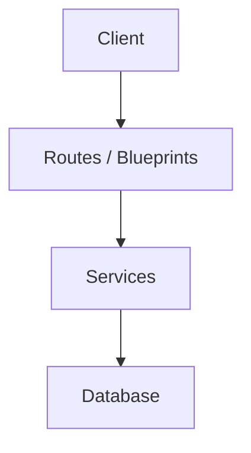
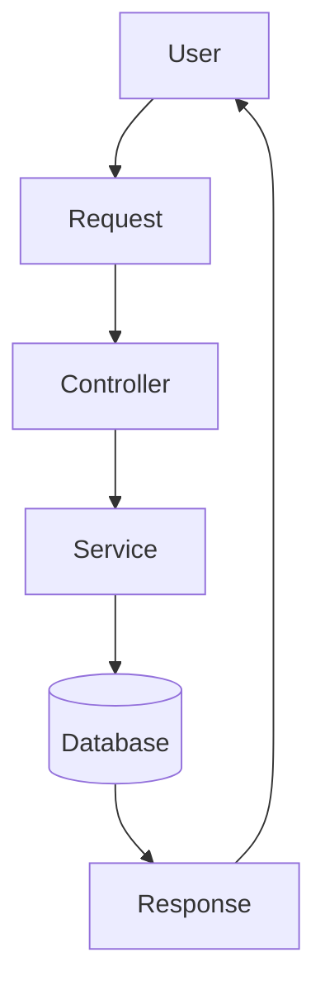
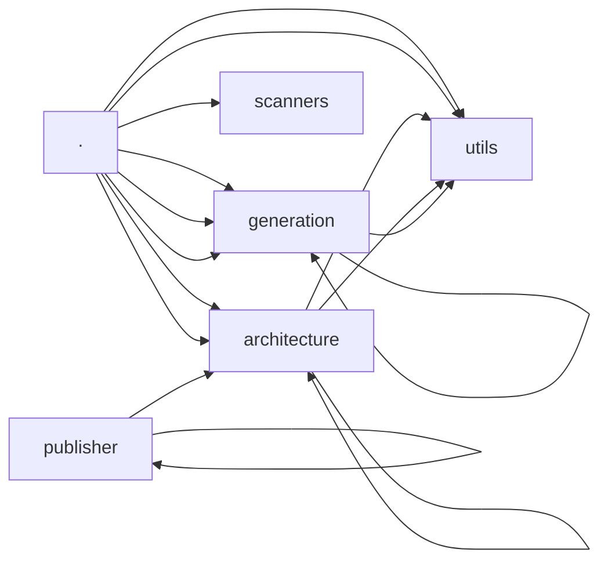
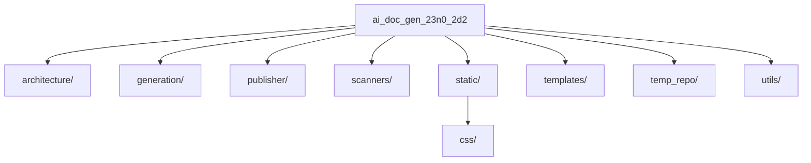

# ai_doc_gen_23n0_2d2

## Objectif du projet

**ai_doc_gen_23n0_2d2** est un projet basé sur Python, pip (Python). 

## Fonctionnement général

Le projet démarre via `app.py`, puis suit une organisation de type **Flask Architecture**. Une analyse IA plus poussée (Ollama) permettrait de détailler précisément l'enchaînement des appels entre modules.

## Technologies utilisées

Python, pip (Python)

## Architecture

Architecture détectée : **Flask Architecture** (confiance estimée : 47.2%).

## Modules principaux

- `generation/ecrivain.py` : Module Python. Nombre de lignes: 151. Elements detectés: def nettoyer_nom_repo, def chemin_doc_fichier, def ecrire_fichier
- `generation/mkdocs_generator.py` : Module Python. Nombre de lignes: 63. Elements detectés: def construire_arbre_nav, def arbre_vers_nav_yaml, def generer_mkdocs_yml
- `architecture/rapport.py` : Module Python. Nombre de lignes: 256. Elements detectés: def _generer_barre, def _formater_liste_signaux, def _section_resultat
- `app.py` : Module Python. Nombre de lignes: 266. Elements detectés: def inject_user, def home, def login
- `architecture/detecteur.py` : Module Python. Nombre de lignes: 249. Elements detectés: def _normaliser, def _poids_profondeur, def _collecter_tous_signaux_par_categorie
- `utils/tree_utils.py` : Module Python. Nombre de lignes: 34. Elements detectés: def aplatir_arbre, def parcourir, def trier_arbre
- `publisher/repo_creator.py` : Module Python. Nombre de lignes: 149. Elements detectés: class RepoCreationError, def creer_repo_github, def creer_repo_gitlab
- `architecture/api_route_detector.py` : Module Python. Nombre de lignes: 183. Elements detectés: def detecter_routes, def _extraire_routes_du_fichier, def _analyser_decorateur

## Flux de données

Flux de données non déterminé automatiquement (analyse IA indisponible) :
se référer au diagramme de flux de données généré ci-dessous pour un
schéma générique basé sur l'architecture détectée.

## Points d'entrée

- `app.py`
- `models.py`

## Dépendances importantes

- Aucune dépendance clé identifiée automatiquement.

## Recommandations

- Maintenir une séparation claire des responsabilités entre modules.
- Vérifier la couverture de tests des modules principaux.
- Documenter les points d'entrée du projet (API, scripts, jobs).


## Architecture

Architecture détectée : Flask Architecture (confiance 47.2%), score 4.7/10. Signaux principaux ayant motivé cette détection : Dossiers caractéristiques détectés : static, templates; Modèles de données détectés; Dépendances Python (requirements.txt); Point d'entrée Flask détecté (app.py). Architectures alternatives envisagées : Hexagonal Architecture (15.4%).

## Code Overview


### app.py

Role:
Module Python. Nombre de lignes: 266. Elements detectés: def inject_user, def home, def login

Classes:
None

Functions:
inject_user, home, login, register, logout, dashboard, analyser, voir_historique, statut_historique, supprimer_historique, supprimer_tout_historique, set_theme, arborescence, generer_resume_ia, arborescence_cible

Dependencies:
os, json, logging, threading, shutil, tempfile, yaml, flask, werkzeug.security, dotenv, models, pipeline


### constants.py

Role:
Module Python. Nombre de lignes: 59.

Classes:
None

Functions:
None

Dependencies:
os


### models.py

Role:
Module Python. Nombre de lignes: 73. Elements detectés: class Utilisateurs, def __repr__, class Historique

Classes:
Utilisateurs, Historique

Functions:
__repr__, get_langages, get_tree, get_fichiers_liste, to_dict

Dependencies:
flask_sqlalchemy, datetime, json, utils.tree_utils


### pipeline.py

Role:
Module Python. Nombre de lignes: 456. Elements detectés: def _adapter_fichiers_pour_detection, def _build_tree_from_files, def _inserer_dans_arbre

Classes:
None

Functions:
_adapter_fichiers_pour_detection, _build_tree_from_files, _inserer_dans_arbre, _adapter_infos_ast_pour_architecture_cible, lister_fichiers_depuis_arbre, extraire_resume, construire_tree_json, ajouter_chemin, extraire_pourcentage_confiance, calculer_radar_data, calculer_score_global, get_description_architecture, calculer_stats_transformation, detecter_conflits, get_architecture_fallback

Dependencies:
logging, subprocess, os, shutil, json, typing, generation.ecrivain, generation.mkdocs_generator, scanners.scanner, architecture.detecteur, architecture.ollama_detecteur, generation.analyzer


### summarize_repo.py

Role:
Module Python. Nombre de lignes: 49. Elements detectés: def resumer_repo

Classes:
None

Functions:
resumer_repo

Dependencies:
logging, utils.ollama_client, scanners.scanner


### api_route_detector.py

Role:
Module Python. Nombre de lignes: 183. Elements detectés: def detecter_routes, def _extraire_routes_du_fichier, def _analyser_decorateur

Classes:
None

Functions:
detecter_routes, _extraire_routes_du_fichier, _analyser_decorateur, _nom_objet_racine, _extraire_chemin, _extraire_methodes_flask

Dependencies:
ast, os, typing, logging


### classifieur_fichiers.py

Role:
Module Python. Nombre de lignes: 225. Elements detectés: def _parser_mots_cles, def _parser_imports, def _tokeniser_nom

Classes:
None

Functions:
_parser_mots_cles, _parser_imports, _tokeniser_nom, deviner_role_par_nom, _texte_imports, deviner_role_par_contenu, deviner_role

Dependencies:
logging, os, re, typing


### detecteur.py

Role:
Module Python. Nombre de lignes: 249. Elements detectés: def _normaliser, def _poids_profondeur, def _collecter_tous_signaux_par_categorie

Classes:
None

Functions:
_normaliser, _poids_profondeur, _collecter_tous_signaux_par_categorie, extraire_dossiers, extraire_fichiers_caracteristiques, extraire_frameworks, extraire_imports_depuis_ast, extraire_decorateurs, extraire_classes_depuis_ast, extraire_dependances, _calculer_score_signaux, calculer_scores, normaliser_scores_par_taille, decider_architecture, detecter_conflit

Dependencies:
logging, os, .signaux


### ollama_detecteur.py

Role:
Module Python. Nombre de lignes: 430. Elements detectés: def choisir_fichier_strategique, def _formater_liste_signaux, def construire_prompt

Classes:
None

Functions:
choisir_fichier_strategique, _formater_liste_signaux, construire_prompt, _construire_prompt_conflit, _construire_prompt_normal, interroger_ollama, _tenter_nettoyage_json, detecter_avec_ollama, _resultat_scoring_simple, _resultat_fallback_ollama, _traiter_reponse_conflit, _traiter_reponse_normale

Dependencies:
json, logging, os, typing, utils.ollama_client, re


### openapi_generator.py

Role:
Module Python. Nombre de lignes: 137. Elements detectés: def _grouper_routes_par_chemin, def _normaliser_chemin, def _construire_operations

Classes:
None

Functions:
_grouper_routes_par_chemin, _normaliser_chemin, _construire_operations, _construire_parametres, _deduire_tag, sauvegarder_spec

Dependencies:
json, os, re, typing


## Diagrammes

### Architecture Diagram



### Data Flow Diagram



### Module Dependency Diagram



### Project Tree Diagram



## Informations Git

- Branche : `main`
- Commit : `88500012`
- Auteur : kbalsem
- Nombre de commits : 1

## Structure du projet

```text
├── .gitignore
├── app.py
├── constants.py
├── models.py
├── pipeline.py
├── requirements.txt
└── summarize_repo.py
├── architecture/
│   ├── api_route_detector.py
│   ├── classifieur_fichiers.py
│   ├── detecteur.py
│   ├── ollama_detecteur.py
│   ├── openapi_generator.py
│   ├── rapport.py
│   ├── restructeur.py
│   └── signaux.py
├── generation/
│   ├── analyzer.py
│   ├── doc_generator.py
│   ├── ecrivain.py
│   ├── mkdocs_generator.py
│   ├── project_doc.py
│   ├── prompts.py
│   ├── readme_generator.py
│   └── swagger_page_generator.py
├── publisher/
│   ├── git_publisher.py
│   ├── repo_creator.py
│   └── strategie.py
├── scanners/
│   └── scanner.py
├── static/
│   └── css/
│       ├── style.css
│       └── themes.css
├── temp_repo/
├── templates/
│   ├── dashboard.html
│   ├── en_cours.html
│   ├── erreur.html
│   ├── index.html
│   ├── login.html
│   ├── register.html
│   └── resultat.html
└── utils/
    ├── auth.py
    ├── db_helpers.py
    ├── ollama_client.py
    └── tree_utils.py
```

## Description des modules

- **./** : 5 fichier(s), 2 classe(s), 36 fonction(s).
- **architecture/** : 8 fichier(s), 79 fonction(s).
- **generation/** : 8 fichier(s), 36 fonction(s).
- **publisher/** : 3 fichier(s), 1 classe(s), 14 fonction(s).
- **scanners/** : 1 fichier(s), 5 fonction(s).
- **utils/** : 4 fichier(s), 9 fonction(s).

---

*Documentation générée automatiquement.*