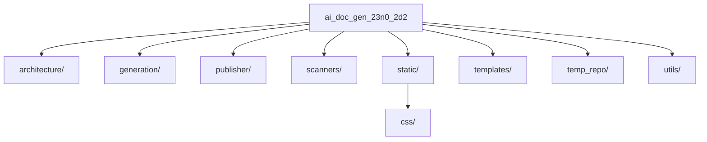

# Diagramme du projet

```mermaid
graph TD
ROOT["ai_doc_gen_23n0_2d2"]
ROOT_architecture["architecture/"]
ROOT --> ROOT_architecture
ROOT_generation["generation/"]
ROOT --> ROOT_generation
ROOT_publisher["publisher/"]
ROOT --> ROOT_publisher
ROOT_scanners["scanners/"]
ROOT --> ROOT_scanners
ROOT_static["static/"]
ROOT --> ROOT_static
ROOT_static_css["css/"]
ROOT_static --> ROOT_static_css
ROOT_templates["templates/"]
ROOT --> ROOT_templates
ROOT_temp_repo["temp_repo/"]
ROOT --> ROOT_temp_repo
ROOT_utils["utils/"]
ROOT --> ROOT_utils
```
