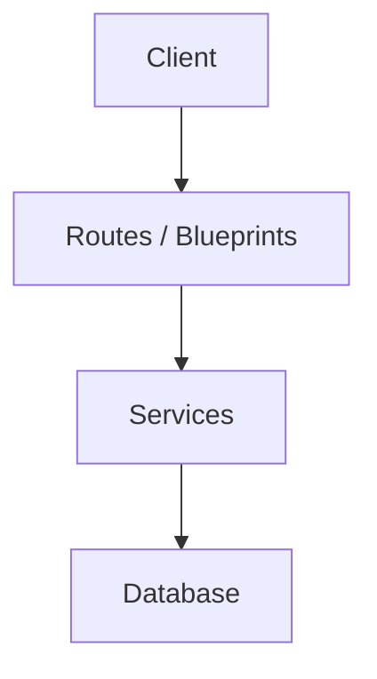
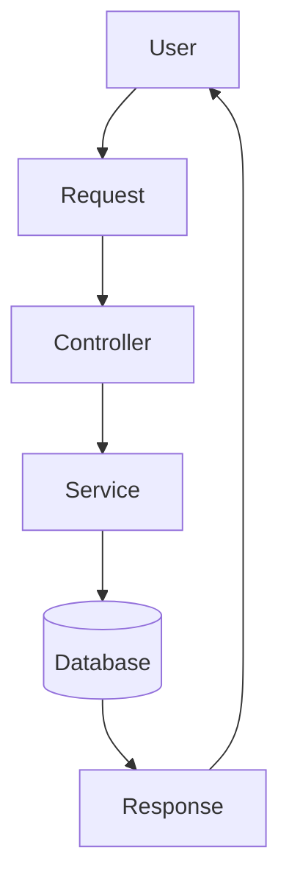
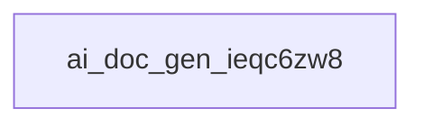

# ai_doc_gen_ieqc6zw8

**Objectif du projet**
Le projet `ai_doc_gen_ieqc6zw8` vise à créer une application qui génère automatiquement des documents de documentation pour un projet spécifique. L'objectif principal est de fournir une solution rapide et efficace pour les développeurs qui doivent créer des documents de documentation pour leur projet.

**Fonctionnement général**
L'application est construite en utilisant la technologie Python et utilise la bibliothèque Flask comme framework web. Le système fonctionne en suivant un flux de travail qui implique la génération de documents de documentation à partir d'un ensemble de données. Les modules principaux de l'application sont chargés pour traiter les données et générer les documents.

**Technologies utilisées**
Les technologies principales utilisées dans ce projet sont :

* Python : Langage de programmation utilisé pour développer l'application
* pip (Python) : Gestionnaire de dépendances utilisé pour gérer les dépendances de l'application

**Architecture**
L'architecture de l'application est basée sur la Flask Architecture, avec une confiance de 30.6% en cette architecture. L'architecture est composée de plusieurs modules principaux qui travaillent ensemble pour traiter les données et générer les documents.

**Modules principaux**
Les modules principaux de l'application sont :

* `app.py` : Module contenant les fonctions d'injection d'utilisateur, de page d'accueil et de connexion
* `pipeline.py` : Module contenant les fonctions pour traiter les fichiers et générer les documents
* `models.py` : Module contenant les classes pour représenter les utilisateurs et l'historique

**Flux de données**
Le flux de données dans l'application implique la génération de documents de documentation à partir d'un ensemble de données. Les modules principaux sont chargés pour traiter les données et générer les documents.

**Points d'entrée**
Les points d'entrée de l'application sont :

* `app.py` : Module contenant les fonctions d'injection d'utilisateur, de page d'accueil et de connexion
* `models.py` : Module contenant les classes pour représenter les utilisateurs et l'historique

**Dépendances importantes**
Aucune dépendance clé identifiée automatiquement.

**Recommandations**
Pour améliorer la qualité du projet, il est recommandé de :

* Ajouter des tests unitaires pour chaque module principal
* Optimiser le système de génération de documents pour améliorer la performance
* Considérer l'ajout d'une fonctionnalité de validation des données pour garantir la qualité des documents générés.

## Architecture

Architecture détectée : Flask Architecture (confiance 30.6%), score 3.1/10. Signaux principaux ayant motivé cette détection : Modèles de données détectés; Dépendances Python (requirements.txt); Point d'entrée Flask détecté (app.py).

## Diagrammes

### Architecture Diagram



### Data Flow Diagram



### Module Dependency Diagram


### Project Tree Diagram



## Informations Git

- Branche : `main`
- Commit : `88500012`
- Auteur : kbalsem
- Nombre de commits : 1

## Structure du projet

```text
├── .gitignore
├── app.py
├── constants.py
├── models.py
├── pipeline.py
├── requirements.txt
└── summarize_repo.py
```

## Description des modules

- **./** : 5 fichier(s), 2 classe(s), 36 fonction(s).

---

*Documentation générée automatiquement.*