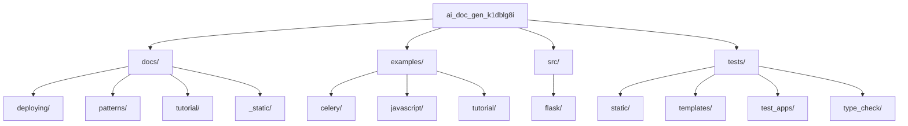

# Diagramme du projet

```mermaid
graph TD
ROOT["ai_doc_gen_k1dblg8i"]
ROOT_docs["docs/"]
ROOT --> ROOT_docs
ROOT_docs_deploying["deploying/"]
ROOT_docs --> ROOT_docs_deploying
ROOT_docs_patterns["patterns/"]
ROOT_docs --> ROOT_docs_patterns
ROOT_docs_tutorial["tutorial/"]
ROOT_docs --> ROOT_docs_tutorial
ROOT_docs__static["_static/"]
ROOT_docs --> ROOT_docs__static
ROOT_examples["examples/"]
ROOT --> ROOT_examples
ROOT_examples_celery["celery/"]
ROOT_examples --> ROOT_examples_celery
ROOT_examples_javascript["javascript/"]
ROOT_examples --> ROOT_examples_javascript
ROOT_examples_tutorial["tutorial/"]
ROOT_examples --> ROOT_examples_tutorial
ROOT_src["src/"]
ROOT --> ROOT_src
ROOT_src_flask["flask/"]
ROOT_src --> ROOT_src_flask
ROOT_tests["tests/"]
ROOT --> ROOT_tests
ROOT_tests_static["static/"]
ROOT_tests --> ROOT_tests_static
ROOT_tests_templates["templates/"]
ROOT_tests --> ROOT_tests_templates
ROOT_tests_test_apps["test_apps/"]
ROOT_tests --> ROOT_tests_test_apps
ROOT_tests_type_check["type_check/"]
ROOT_tests --> ROOT_tests_type_check
```
