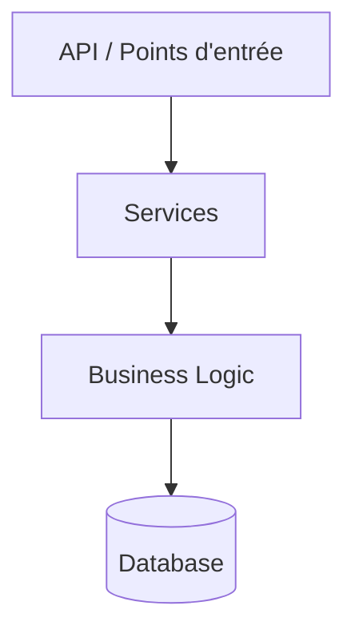
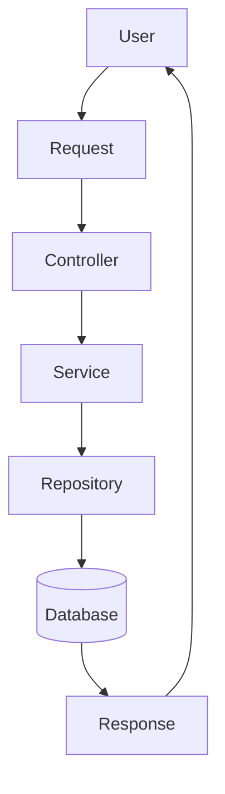
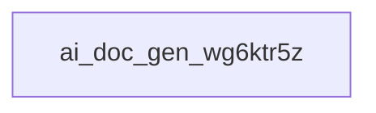

# ai_doc_gen_wg6ktr5z

## Objectif du projet

**ai_doc_gen_wg6ktr5z** est un projet basé sur GitHub Actions (CI/CD), Python (pyproject).  D'après son README, il s'agit de : « Flask is a lightweight [WSGI] web application framework ».

## Fonctionnement général

Aucun point d'entrée explicite n'a été identifié automatiquement. Le projet semble organisé selon une architecture de type **Monolithic** ; se référer à la structure du projet ci-dessous pour identifier le point de démarrage.

## Technologies utilisées

GitHub Actions (CI/CD), Python (pyproject)

## Architecture

Architecture détectée : **Monolithic** (confiance estimée : 50%).

## Modules principaux

- Aucun module clé identifié automatiquement.

## Flux de données

Flux de données non déterminé automatiquement (analyse IA indisponible) :
se référer au diagramme de flux de données généré ci-dessous pour un
schéma générique basé sur l'architecture détectée.

## Points d'entrée

- Aucun point d'entrée identifié automatiquement.

## Dépendances importantes

- Aucune dépendance clé identifiée automatiquement.

## Recommandations

- Maintenir une séparation claire des responsabilités entre modules.
- Vérifier la couverture de tests des modules principaux.
- Documenter les points d'entrée du projet (API, scripts, jobs).


## Architecture

Architecture détectée : Monolithic (confiance 50%), score 0/10. Signaux principaux ayant motivé cette détection : Aucun pattern architectural spécifique détecté : le projet semble organisé comme une application centralisée unique plutôt que selon un pattern connu (MVC, Clean, Hexagonal...)..

## Diagrammes

### Architecture Diagram



### Data Flow Diagram



### Project Tree Diagram



## Informations Git

- Branche : `main`
- Commit : `36e4a824`
- Auteur : David Lord
- Nombre de commits : 1

## Structure du projet

```text
├── .editorconfig
├── .gitignore
├── .pre-commit-config.yaml
├── .readthedocs.yaml
├── CHANGES.rst
├── LICENSE.txt
├── README.md
├── pyproject.toml
└── uv.lock
```


---

*Documentation générée automatiquement.*