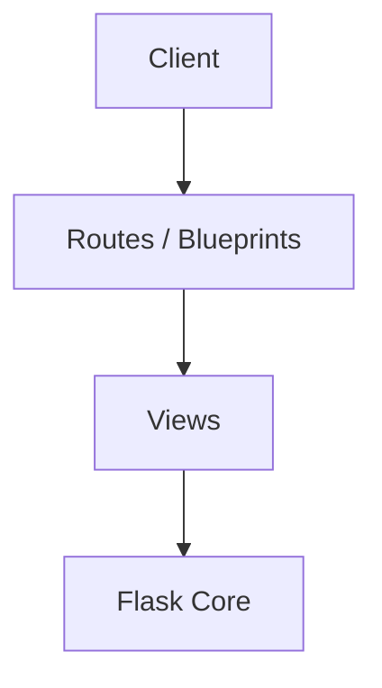
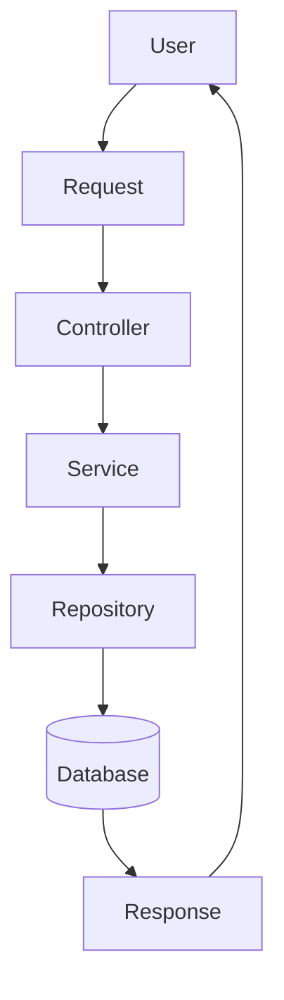
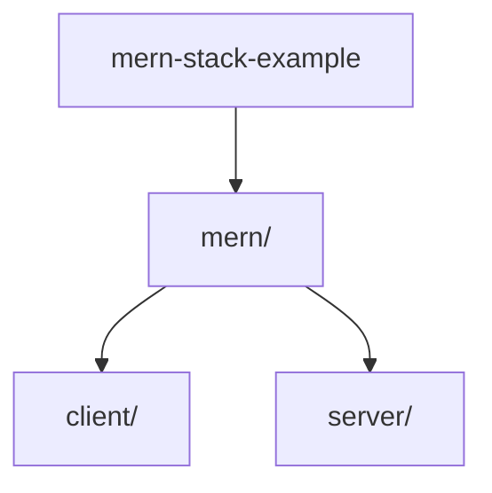

# mern-stack-example

### Objectif du projet

Le but principal de ce projet est de créer une application full-stack CRUD (Create, Read, Update, Delete) pour gérer les enregistrements d'employés. L'application utilise la technologie MERN (MongoDB, Express, React, Node.js) et est conçue pour démontrer un exemple de mise en œuvre complète de cette stack.

### Fonctionnement général

L'application est composée de deux parties principales : la partie client (front-end) et la partie serveur (back-end). La partie client est construite avec React et utilise Cypress pour les tests d'intégration. La partie serveur est construite avec Express et Node.js, et utilise MongoDB comme base de données.

Lorsque l'utilisateur crée un nouveau record, il est enregistré dans la base de données MongoDB. Les records peuvent ensuite être lisibles, mis à jour ou supprimés via une interface utilisateur intuitive. L'application utilise des routes pour gérer les requêtes HTTP et des endpoints pour interagir avec la base de données.

### Technologies utilisées

* JavaScript (React, Node.js)
* React
* Express
* MongoDB
* Cypress
* Tailwind CSS

### Architecture

L'architecture de l'application est basée sur le modèle MERN. La partie client est construite avec React et utilise Cypress pour les tests d'intégration. La partie serveur est construite avec Express et Node.js, et utilise MongoDB comme base de données.

La structure du projet est organisée en deux parties principales : `mern/client` et `mern/server`. Chacune de ces parties contient ses propres fichiers et structures de répertoire.

### Modules principaux

Les modules principaux de l'application sont :

* La partie client (React)
* La partie serveur (Express, Node.js)
* Les routes pour gérer les requêtes HTTP
* Les endpoints pour interagir avec la base de données

### Flux de données

Le flux de données de l'application est le suivant :

1. L'utilisateur crée un nouveau record.
2. Le record est enregistré dans la base de données MongoDB.
3. La partie serveur reçoit la requête HTTP pour créer un nouveau record.
4. La partie serveur enregistre le record dans la base de données.
5. La partie client reçoit les données du record et les affiche à l'utilisateur.

### Points d'entrée

Les points d'entrée de l'application sont :

* `mern/client/cypress/plugins/index.js`
* `mern/client/cypress/support/index.js`
* `mern/server/server.js`
* `mern/client/src/App.jsx`

Ces fichiers contiennent les configurations et les logiques pour gérer les requêtes HTTP et interagir avec la base de données.

### Dépendances importantes

Aucune dépendance clé n'a été identifiée automatiquement. Cependant, l'application utilise des dépendances telles que Cypress et Tailwind CSS pour les tests d'intégration et la mise en forme de l'interface utilisateur.

### Recommandations

* Utiliser des pratiques de développement plus sécurisées telles que l'utilisation de HTTPS et des méthodes de validation de données.
* Optimiser les performances de l'application en utilisant des techniques telles que la cache et la minimisation des fichiers.
* Ajouter des tests unitaires et d'intégration pour garantir la qualité de l'application.

## Architecture

Architecture détectée : Flask Architecture (confiance 7.1%), score 0.7/10. Signaux principaux ayant motivé cette détection : Dossiers caractéristiques détectés : src. Architectures alternatives envisagées : REST API (27.3%). Attention : le score est proche de celui de « REST API », la distinction n'est pas totalement tranchée.

## Diagrammes

### Architecture Diagram



### Data Flow Diagram



### Project Tree Diagram



## Informations Git

- Branche : `main`
- Commit : `b8731215`
- Auteur : sis0k0
- Nombre de commits : 1

## Structure du projet

```text
├── .gitignore
├── AGENTS.md
├── EDD.md
├── LICENSE
└── README.md
└── mern/
    ├── client/
    │   ├── .eslintrc.cjs
    │   ├── .gitignore
    │   ├── cypress.config.js
    │   ├── index.html
    │   ├── package.json
    │   ├── postcss.config.js
    │   ├── tailwind.config.js
    │   └── vite.config.js
    │   ├── cypress/
    │   │   ├── e2e/
    │   │   │   └── endToEnd.cy.js
    │   │   ├── fixtures/
    │   │   │   └── example.json
    │   │   ├── integration/
    │   │   │   └── endToEnd.spec.js
    │   │   ├── plugins/
    │   │   │   └── index.js
    │   │   └── support/
    │   │       ├── commands.js
    │   │       ├── e2e.js
    │   │       └── index.js
    │   ├── public/
    │   │   └── vite.svg
    │   └── src/
    │       ├── App.jsx
    │       ├── index.css
    │       └── main.jsx
    │       ├── assets/
    │       │   └── mongodb.svg
    │       └── components/
    │           ├── Navbar.jsx
    │           ├── Record.jsx
    │           └── RecordList.jsx
    └── server/
        ├── config.env.example
        ├── package.json
        ├── seed.js
        └── server.js
        ├── db/
        │   └── connection.js
        └── routes/
            └── record.js
```

## Description des modules

- **mern/client/** : 3 fichier(s).
- **mern/client/cypress/e2e/** : 1 fichier(s).
- **mern/client/cypress/integration/** : 1 fichier(s).
- **mern/client/cypress/plugins/** : 1 fichier(s).
- **mern/client/cypress/support/** : 2 fichier(s).
- **mern/client/src/** : 2 fichier(s), 1 fonction(s).
- **mern/client/src/components/** : 3 fichier(s), 12 fonction(s).
- **mern/server/** : 2 fichier(s).
- **mern/server/db/** : 1 fichier(s).
- **mern/server/routes/** : 1 fichier(s).

---

*Documentation générée automatiquement.*