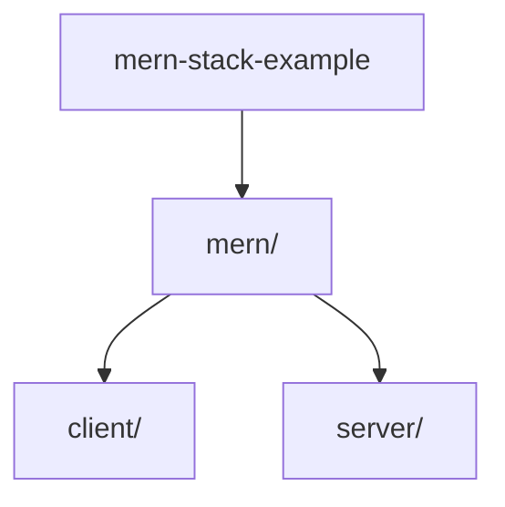

# Diagramme du projet

```mermaid
graph TD
ROOT["mern-stack-example"]
ROOT_mern["mern/"]
ROOT --> ROOT_mern
ROOT_mern_client["client/"]
ROOT_mern --> ROOT_mern_client
ROOT_mern_server["server/"]
ROOT_mern --> ROOT_mern_server
```
