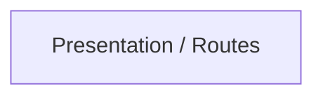
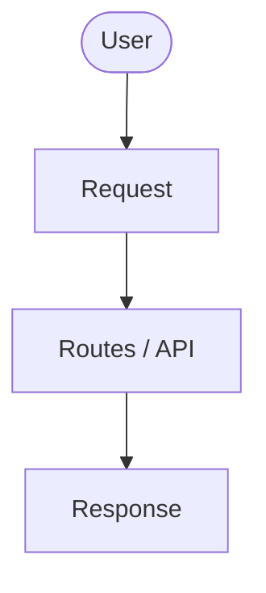
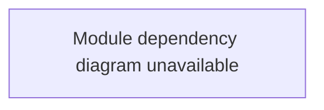
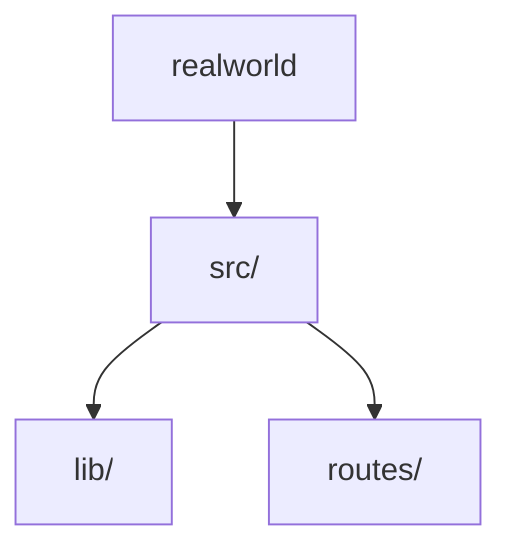

# Diagrammes du projet

## Architecture

```mermaid
graph TD
presentation["Presentation / Routes"]
```

## Flux de données

```mermaid
graph TD
user(["User"])
request["Request"]
routes["Routes / API"]
response["Response"]
user --> request
request --> routes
routes --> response
```

## Dépendances des modules

```mermaid
graph TD
info["Module dependency diagram unavailable"]
```

## Arborescence du projet

```mermaid
graph TD
ROOT["realworld"]
ROOT_src["src/"]
ROOT --> ROOT_src
ROOT_src_lib["lib/"]
ROOT_src --> ROOT_src_lib
ROOT_src_routes["routes/"]
ROOT_src --> ROOT_src_routes
```
